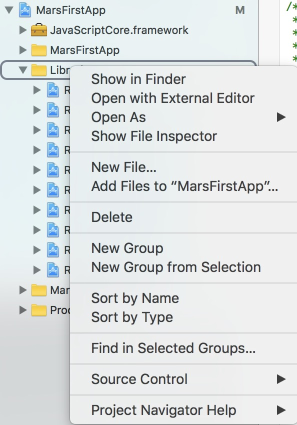
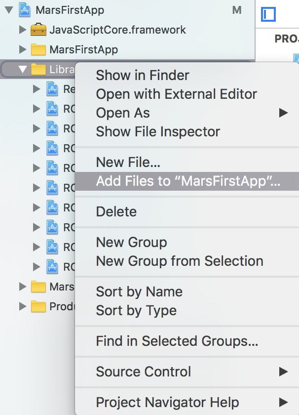
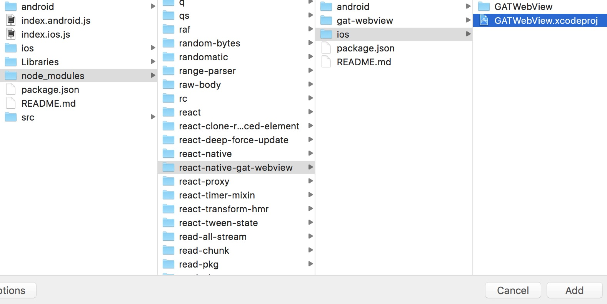
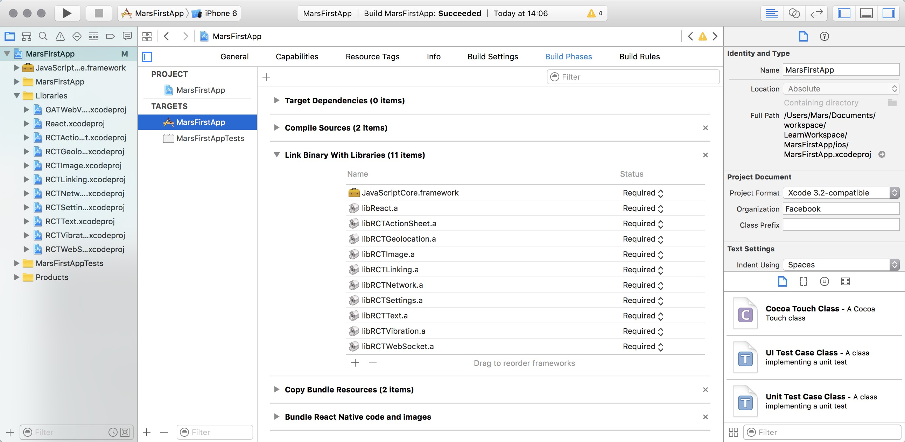
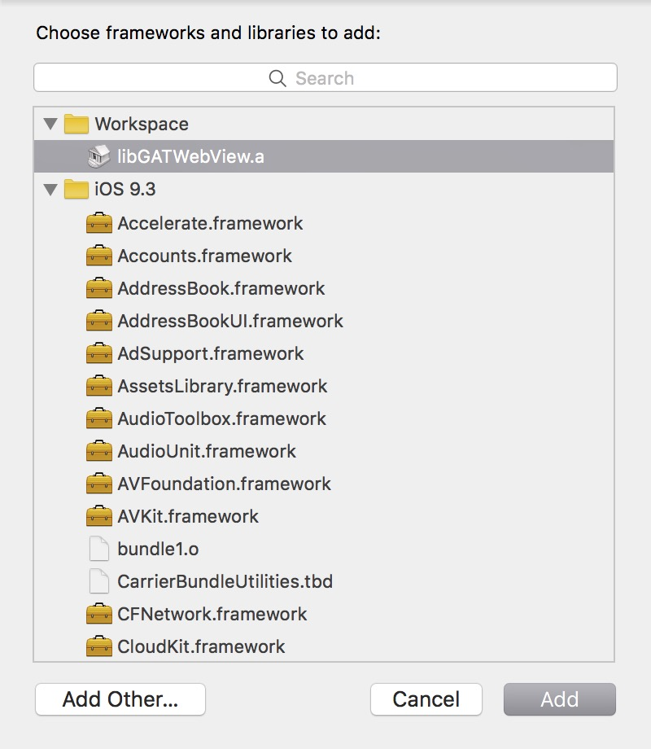
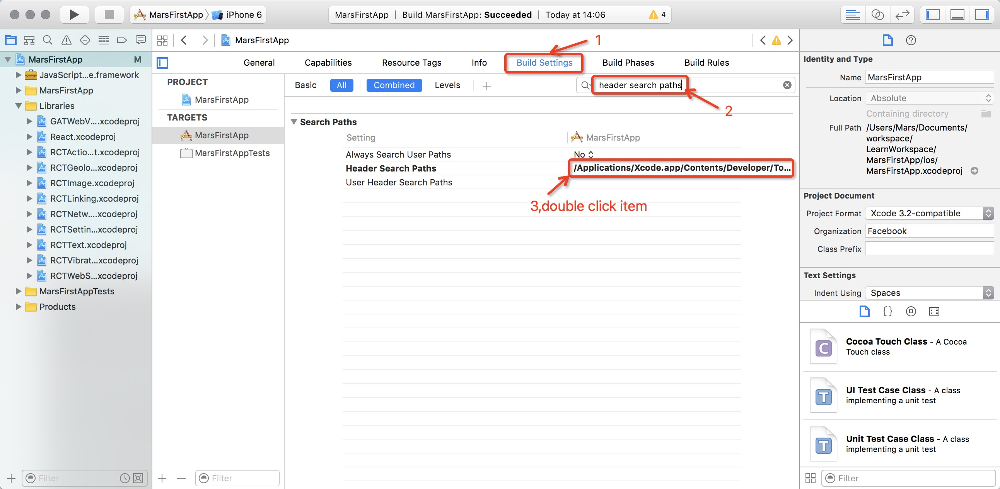
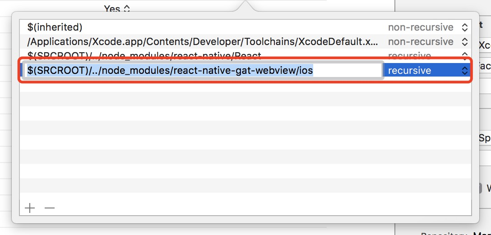

# GATWebView

## Installation
1, add the following codes to your `your project folder/package.json`
```
"dependencies": {
    "react-native-gat-webview":"guanaitong/GATWebView.git#0.20"
  }
```
2, use command
```
$npm install
```

## IOS
1, go to xcode's Project Navigator tab
<p align="center">
    
</p>

2, right click on `Libraries`

3, select `Add Files to ...` option
<p align ="center">
  
</p>

4, navigate to `node_modules/react-native-gat-webview/ios` and add `GATWebView.xcodeproj` folder
<p align ="center">
  
</p>

5, on project `Project Navigator` tab, click on your project's name and select Target's name and from there click on `Build Phases`
<p align ="center">
  
</p>

6, expand `Link Binary With Libraries` and click `+` sign to add a new one.

7, select `libGATWebView.a` and click `Add` button.
<p align ="center">
  
</p>

8, click `Build Settings` and search `Header Search Paths` on the search box. double click item.
<p align ="center">
  
</p>

9, click `+` write in `$(SRCROOT)/../node_modules/react-native-gat-webview/ios` and select `recursive`.
<p align ="center">
  
</p>

10, clean compile to make sure your project can compile and build.

## Android
1, add the following codes to your `android/settings.gradle`
```
include ':app', ':react-native-gat-webview'
project(':react-native-gat-webview').projectDir = new File(rootProject.projectDir, '../node_modules/react-native-gat-webview/android')
```
2, edit `android/app/build.gradle` and add the following line inside `dependencies`
```
compile project(':react-native-gat-webview')
```
3, add the following import to `MainApplication.java` of your application

```java
import com.gatwebview.GATWebViewPackage;
```

4, add the following code to add the package to `MainApplication.java`

```java
protected List<ReactPackage> getPackages() {
        return Arrays.<ReactPackage>asList(
            new MainReactPackage(),
            new GATWebViewPackage() //<- this
        );
    }
```
5, run `react-native run-android` to see if everything is compilable.

## Usage

just import the module
```js
import GATWebView from 'react-native-gat-webview';
```
#### schemeShield
Configuration `schemeShield` implement requester block and callback.

#### functionName
`Android only`
This is Android native `WebView` method , implement `html->javascript` visit `react-native`.

#### callJavaScript(message)
the message must be in string. because this is the only way to send data back and forth between native and webview.

#### onCallBackMessage
It's callback message for  `html->javascript` visit `react-native`.

## Simple Example
`WebViewComponent.js`
```js
'use strict';

import React,{Component} from 'react';
import {
  WebView,
  StyleSheet,
  View,
  Text,
  Alert,
} from 'react-native';
import GATWebView from 'react-native-gat-webview';
var WEBVIEW_REF = 'gatwebview';
class WebViewComponent extends Component{

  _onCallBackMessage(event:Event){

      Alert.alert('Message:'+event);

    if(event === `{'key1':'value1','key2':2}`){
      this.refs[WEBVIEW_REF].callJavaScript(`show('cc')`);
    }

  }

  render(){
    return(
      <View style={{flex:1}}>
        <GATWebView
          ref={WEBVIEW_REF}
          source={require('./webview.html')}
          javaScriptEnabled={true}
          domStorageEnabled={true}
          startInLoadingState={true}
          schemeShield = {['gatimage','gatpay','gatapp']}
          functionName = {'react'}
          mediaPlaybackRequiresUserAction ={true}
          onCallBackMessage = {this._onCallBackMessage.bind(this)}/>
          </View>
    );
  }

}

export default WebViewComponent;

```
`webview.html`
```html
<!DOCTYPE html>
<html lang="en">
<head>
    <meta charset="UTF-8">
    <title>Title</title>
    <style type="text/css">
    .btn{
      margin-top: 100px;
    }
    </style>
</head>
<script  type="text/javascript">
  function listener(vlue){
    if (/(iPhone|iPad|iPod|iOS)/i.test(navigator.userAgent)) {
      onEventListener(vlue);
    } else if (/(Android)/i.test(navigator.userAgent)) {
    //react is GATWebView->javascriptInterface define.
      react.onEventListener(vlue);
    }
  }
  function welcome(){
    listener('{\'key1\':\'value1\',\'key2\':2}');
  }

</script>
<body>
<input type="button" value="Touch me" onclick="welcome();" class = "btn">
<br/>
<a href="gatpay://pay?{'status':'9中文'}">pay</a>
<a href="gatimage://image?{'status':'9中文'}">image</a>
<a href="gatapp://app?{'status':'9中文'}">app</a>
<br/>
<p id="demo"></p>
</body>
</html>
<script>
  var x=document.getElementById("demo");
  function show(value)
  {
    x.innerHTML=x.innerHTML+value;
  }
</script>


```
